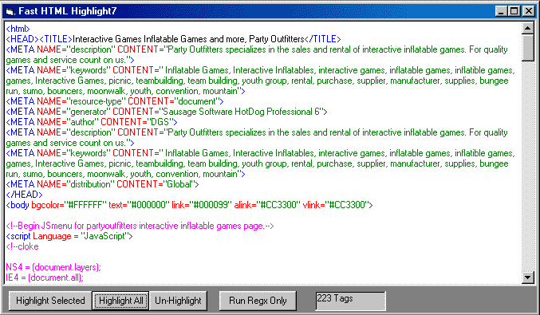

<div align="center">

## Fast HTML highlite7


</div>

### Description

HTML syntax highlite using regular expressions

This is meant as a regular expressions tutorial.

This new version contains an extra form with

Heavy commenting.

Will properly highlight syntax that stumps most syntax highlighters.

Also includes inline syntax highlighting

although this isn't nearly as good as the main

colorHTML funtion.

I have also added a button that runs the regular expression without highlighting the rtf text.

I added this because people have complained that this code isn't that fast.

The regular expresions are very fast.

Selecting the text and changing the color in the rtf box is what is slow. Of all the html syntax highlighters I have seen posted here this is the Fastest accept for one that writes raw rtf to a file. I have been playing with this to see if I can speed this one up the same way.

Comments and suggestions welcome.

and Please Vote.
 
### More Info
 


<span>             |<span>
---                |---
**Submitted On**   |2001-10-27 18:30:46
**By**             |[RegX](https://github.com/Planet-Source-Code/PSCIndex/blob/master/ByAuthor/regx.md)
**Level**          |Intermediate
**User Rating**    |4.7 (33 globes from 7 users)
**Compatibility**  |VB 6\.0
**Category**       |[Internet/ HTML](https://github.com/Planet-Source-Code/PSCIndex/blob/master/ByCategory/internet-html__1-34.md)
**World**          |[Visual Basic](https://github.com/Planet-Source-Code/PSCIndex/blob/master/ByWorld/visual-basic.md)
**Archive File**   |[Fast HTML 3151710272001\.zip](https://github.com/Planet-Source-Code/regx-fast-html-highlite7__1-28461/archive/master.zip)

### API Declarations

```
' Needs reference to Microsoft VBscript Regular Expressions.
I reccomend 5.5
' Get it at http://msdn.microsoft.com/downloads/default.asp?URL=/downloads/sample.asp?url=/msdn-files/027/001/733/msdncompositedoc.xml
```


